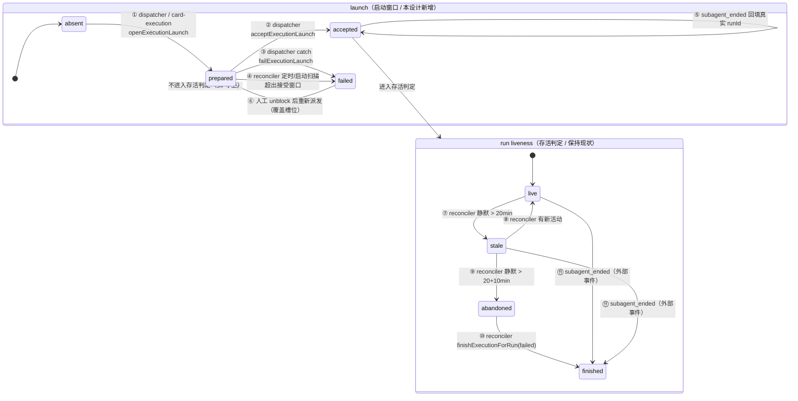

# 15.7 会话生命周期设计

> 对 [[15-上游2026.9.4差异评估]] 第 7 项「会话生命周期两阶段落地」的设计小结。**已定：走路线 C**。
> 核实日期：2026-09-18。宿主 `2026.9.4`（`3a9d69d`），Taskfold 依赖声明 `openclaw@2026.7.1-2`。
> 本文只做设计决策与实施拆分，不含实现代码。

## 1. 结论

**路线 C：只把 `prepared → accepted → failed` 三段式盖在现有本地证据判活之上。**

分工一句话讲清：

- **launch 三段式**负责「这次**启动**到底有没有被宿主接受」——只覆盖从赢得 claim 到 `subagent.run()` 返回这一段窗口。
- **本地证据判活**（`reconciler.ts` + `lifecycle.ts`）继续负责「这个已经被接受的 run **到底还活着吗**」——心跳/活动时间、`stale`、`abandoned`、孤儿 run 收尾。

两者不重叠、不互相替代，任何一条边都不需要读宿主 session 状态。

不做：上游 `lifecycle-sync.ts` 的 `sessions.list` 定时快照扫描（数据源在 Taskfold 上不存在，见 §3）。
额外做（同一批、可独立验证）：上游 `session-link.ts` 的 **session key 匹配**（终态事件按 `targetSessionKey` 兜底匹配）、上游 `store-lifecycle.ts` 的 **runtime lifecycle 注册**（Taskfold 目前完全没有）。

## 2. 功课记录：两边到底是什么

### 2.1 上游的三段式不在那三个文件里

[[15-上游2026.9.4差异评估]] 把 `lifecycle-sync.ts` + `store-lifecycle.ts` + `session-link.ts` 描述成「显式 `prepared → accepted → failed` 状态机」。读完真实源码后，这个归类是**错的**（勘误见 §10）。实际分布：

| 内容 | 真实位置 |
|---|---|
| `WorkboardLaunchState` 类型（`prepared`/`accepted`/`failed` 三个变体 + `WorkboardLaunchIdentity`） | `packages/workboard-contract/src/index.ts:253-271` |
| 状态**存哪** | `card.metadata.automation.launch`，即卡片 metadata JSON 里的一个键。**没有专用表、没有专用列** |
| 三条转移的实现 | `extensions/workboard/src/store.ts`：`prepareExecutionLaunch`(:192)、`acceptExecutionLaunch`(:241)、`failPreparedLaunch`(:273)、`syncLifecycle`(:312) |
| 转移的准入守卫 | 同文件 `preparedLaunchMatchesCard`(:68)、`acceptedLaunchForAssociation`(:85)、`executionAssociationPatch`(:120) |
| 归一化 + 信任门 | `store-normalizers.ts:507 normalizeLaunchState`，经 `normalizeAutomation` 的 `options.allowLaunchState`(:473) 与 `normalizeMetadata` 的 `allowAutomationLaunch`(:1122) 控制；只有 `store.ts` 的四个方法传 `{ allowAutomationLaunch: true }`，公共工具/网关写路径写不进 launch |
| 谁写 `prepared`/`accepted`/`failed` | `extensions/workboard/src/dispatcher.ts`：:495 prepare、:537 accept、:579 fail |
| `lifecycle-sync.ts` 的角色 | **消费方**，不是状态机所有者。它把 `sessions.list` 快照映射成 `running/succeeded/failed/idle/stale` 五态观察值，喂给 `store.syncLifecycle`，并在快照完整时对 `prepared` 调 `failPreparedLaunch` |
| `store-lifecycle.ts`（858B / 29 行） | 与三段式**完全无关**。它注册 `api.lifecycle.registerRuntimeLifecycle({id, dispose, cleanup})`，在插件 disable/restart 时先停 service 再 `store.close()` |
| `session-link.ts`（50 行） | session key 派生（`workboardSessionKeyForCard`）与匹配（`workboardCardMatchesLifecycleLink`、`workboardCardSessionLookupKey`）。关键设计：当卡片持有的 runId 是临时 id（`workboard:<cardId>:` 前缀）时，**不因 runId 不等而拒绝匹配**，退回 session key 匹配 |

### 2.2 上游各状态的准入与转移条件

- `prepared`：`prepareExecutionLaunch` 在赢得 claim 之后、调 `subagent.run` 之前写入。同时把卡片的 `sessionKey` 写成**请求的** key、`runId` 写成 `provisionalRunId = workboard:<cardId>:<card.updatedAt>`、`execution.status = running`。准入靠 claim scope（`assertCanMutateClaimedCard`），不是 revision CAS。
- `prepared → accepted`：`acceptExecutionLaunch`，条件是 `preparedLaunchMatchesCard`（launch 三元身份 + 卡片的 sessionKey/runId/execution 四处全都还是 prepared 时写的那套）且 `acceptedAt >= preparedAt`。写入宿主返回的 `run.sessionKey`/`run.runId`，并**原地改键**那条 running attempt（`executionAssociationPatch`），避免出现两条 attempt。
- `prepared → failed`：两个触发方。(a) dispatcher 的 catch（`runStarted === false`）；(b) `lifecycle-sync` 扫描：`launch.phase === "prepared"` 且快照里找不到能证明接受的 session，**且 `snapshot.complete === true`**。
- `accepted` 的「接受证明」谓词：`sessionProvesPreparedAcceptance`（`hasActiveRun === true` 或 status ∈ {done, failed, killed, timeout}）；终态 session 还必须有 `updatedAt`（"durable timing evidence"），否则不接受（`lifecycle-sync.restart.test.ts:307`）。
- 定时扫描：`WORKBOARD_LIFECYCLE_SWEEP_MS = 60_000`（`lifecycle-sync.ts:22`），首次扫描等 `gateway_start` 信号（:528-539）；`WORKBOARD_STALE_SESSION_MS = 30 * 60 * 1000`（:23），判 stale 的条件是 **`session.status === "running" && session.hasActiveRun === false` 且 `now - session.updatedAt >= 30min`**——即 stale 是**宿主快照**驱动的，不是本地活动时间驱动的。
- stale 之后发生什么：只写 `metadata.stale`，卡片仍然保持 `running`（`LIFECYCLE_TARGETS.stale = { card: "running", execution: "running" }`，:107）。不 kill、不收尾。恢复后清 `stale`。
- 进程重启后怎么恢复（`lifecycle-sync.restart.test.ts` 的答案，5 个用例）：
  1. 重启后第一次**完整**快照里找不到该 session → `prepared` 转 `failed`，卡片 `blocked`，claim/sessionKey/runId/execution 全清（:102-162）。
  2. session 在快照里但 `hasActiveRun === false` → 同样 `failed`（:164）。
  3. session 在快照里且 `hasActiveRun === true`（哪怕是 agent 前缀的规范化 key）→ 转 `accepted`，并采纳规范化后的 key（:194）。
  4. session 是终态且带 `updatedAt` → 直接 `accepted` + 卡片 `review`（:267）。
  5. **快照不完整（`complete === false`）→ 什么都不做**，保持 `prepared`（:335）。

  即：上游的重启恢复 **100% 建立在 `sessions.list` 快照及其完整性判定之上**。

### 2.3 `WORKBOARD_SESSION_SWEEP_LIMIT` 与 `complete` 的含义

`readWorkboardLifecycleSessions` 用 `limit: 10_000` 拉 `sessions.list`，并以 `payload.sessions.length < 10_000` 作为「这一页就是全部」的证明（:411-432）。`complete` 是 `failPreparedLaunch` 的**硬前置**（:335-336）。没有快照就永远拿不到 `complete === true`。

### 2.4 Taskfold 侧：`dispatcher.ts` 的全部判活路径

grep `heartbeat|Heartbeat|alive|isAlive|pid|sessions\.list|waitForRun|bindSession` 在 `src/backend/src/dispatcher.ts` 里**只命中一条注释**（:248）。也就是说 dispatcher 从不探活宿主。它实际依赖的「还活着吗」判断全部是本地推断，完整清单：

| # | 位置 | 判断 | 用途 |
|---|---|---|---|
| 1 | `dispatcher.ts:110 cardHasActiveClaim()` | `claim.expiresAt` 在未来 | owner 归属（:228）、候选过滤（:252、:268） |
| 2 | `dispatcher.ts:250` → `store-constants.ts:50 isTaskfoldClaimReclaimable()` | `now - claim.expiresAt > CLAIM_RECLAIM_MS`(5min) | 过期租约不再占 owner 槽 |
| 3 | `dispatcher.ts:249-253 consumesOwnerSlot` | `!reclaimable && (status==="running" \|\| (status!=="done" && 活跃claim) \|\| execution?.status==="running")` | owner 全局容量（每 owner 一张活跃卡） |
| 4 | `dispatcher.ts:259-260 runningByOwner` | `claim?.ownerId ?? resolveDispatchOwner()` | 同上的计数键 |
| 5 | `dispatcher.ts:316/327/480 startedOwners` | 本轮内存集合 | 一轮一个 owner 只起一次 |
| 6 | **`dispatcher.ts:334/478/514/531 runStarted`** | **局部布尔变量** | **决定 catch 里是 block 还是放过** |
| 7 | `dispatcher.ts:418-431 store.claim(expectedAuthority)` | 数据库 CAS | 准入（不是判活） |

**第 6 项是本设计的全部动机**：`runStarted` 就是今天的 `prepared`/`accepted` 状态，它只存在于一个局部变量里，随进程一起消失。进程在 `subagent.run()`（:459）与 `store.update({sessionKey, runId, execution})`（:481）之间死掉，卡片留下的是：有 claim、`status=running`、**没有 sessionKey / runId / execution**。此时 `lifecycle.ts:85` 的 `taskfoldRunEvidence` 因 `!cardSessionKey(card)` 直接返回 `unlinked`，判活链路整条不介入；只有 claim 回收路径（`reconciler.ts:169`）在 TTL 30min + 5min 宽限后把卡片放出来。这就是要补的洞。

`card-execution.ts` 是第二条启动路径（`startTaskfoldCardExecution`，:277），窗口结构完全一样：`subagent.run()`（:353）→ `store.update(sessionKey/runId/execution)`（:369），catch 里 `releaseClaim`（:411）。它自己的活跃判断是 `activeExecution(card)`（:61，`execution.status==="running" || 有 running attempt`）。

`reconciler.ts` + `lifecycle.ts` 的判活（本地证据）：`taskfoldLastActivityAt`（`store-card-helpers.ts:419`，取 `claim.lastHeartbeatAt` / `execution.updatedAt` / `card.updatedAt` 三者最大值）；`RUNNING_HEARTBEAT_STALE_MS = 20min`（`store-constants.ts:24`）；`ABANDONED_RUN_GRACE_MS = 10min`（`lifecycle.ts:41`）；扫描间隔 `RECONCILE_INTERVAL_MS = 15_000`（`reconciler.ts:32`）+ 启动即跑一次。

### 2.5 `b7abc5c` 当初为什么改成本地证据

提交信息与 [[VERIFICATION|VERIFICATION.md]]「Live-host verification — July 29, 2026」记载的五条实机结论（**不能不了解就推翻**）：

1. `runtime.gateway.request("sessions.list")` 每次都抛 `Gateway requests are only available to bundled or trusted official plugins`；一天 173 条 warning，**没有任何一张卡片被对账过**。`gateway.isAvailable()` 查的是请求上下文，不是信任门，所以守卫过了、调用死。
2. `runtime.tasks.runs.bindSession({sessionKey})` 按 `task.ownerKey` 作用域，对 Taskfold 的 run 来说 ownerKey 是**发起方** session（`agent:main:main`），不是卡片自己的 session，且派发路径永远学不到它。
3. `runtime.subagent.waitForRun({runId})` 对任何不在当前进程存活的 run 都返回 `timeout`，区分不了「早就结束」和「根本不存在」。
4. 宿主任务词表是 `queued|running|succeeded|failed|timed_out|cancelled|lost`，旧代码分支在不存在的 `"completed"` 上；`TaskRunView` 没有 `updatedAt`，而旧代码拿它当状态 provenance —— 所以旧版本其实一次状态都写不出来。
5. `sessions.list` 报 agent 作用域 key（`agent:main:subagent:…`），而没有显式 `agentId` 的卡片存的是无前缀尾段；旧版孤儿检查做字面比较，于是「宿主没有这张卡的 session」对每张卡都成立，**启动扫描会 force-fail 掉每一个活跃 run**。

`test/host-contract.test.ts` 就是为这一类回归钉的桩（用真实宿主载荷 `satisfies TaskRunView`）。本设计不碰它，也不重新引入任何宿主状态源。

**2026.9.4 上信任门仍在**（读的是本机正在跑的宿主源码，不是压缩产物推测）：`~/.nvm/versions/node/v24.21.0/lib/node_modules/openclaw/dist/server-plugins-BgRb-rux.mjs:449` 的 `dispatchTrustedPluginGatewayMethod` 第一句就是 `if (!canTrustedOfficialPluginRequestScopes(scope ?? {})) throw ...`，而 `canTrustedOfficialPluginRequestScopes`（:84-89）只认 `pluginOrigin === "bundled"` 或 `trustedOfficialInstall === true`。Taskfold 走 `plugins.load.paths` 本地路径加载、trust 状态 `reason=record-missing`（[[AGENTS|AGENTS.md]]），两条都不满足。

### 2.6 Taskfold 的 session 关联方式（对应上游 `session-link.ts`）

- 列：`taskfold_cards.session_key` / `run_id`（`sqlite-store.ts:201-202`）、`execution_session_key` / `execution_run_id`（:217-218），并有索引 `taskfold_cards_session_idx ON (session_key, run_id)`（:231）。子表 `taskfold_card_attempts`/`_events`/`_notifications`/`worker_logs` 各自也带 `session_key`/`run_id`。**列已经齐了，不缺。**
- 派生：`dispatcher.ts:115 buildSessionKey()` 与上游 `workboardSessionKeyForCard` 逐字同构（`subagent:taskfold-<board>-<card>`，有 `agentId` 时加 `agent:<id>:` 前缀）。
- **匹配：Taskfold 没有对应物。** 上游 `workboardCardMatchesLifecycleLink` 解决的是「宿主报的 key/runId 与卡片存的不是同一种写法」；Taskfold 今天的唯一匹配点是 `store-workflow.ts:180 finishExecutionForRun(runId)` 的 `cardRunId(candidate) === runId` 字面相等，以及 `dispatcher-workspace.ts:35 cleanupTaskfoldRunWorktree` 的 `entry.runId === runId`。`src/backend/index.ts:61` 的 `subagent_ended` hook 只在 `event.runId` 存在时才转发，**完全丢掉了 `event.targetSessionKey`**。

  这在今天（卡片总是存宿主返回的真 runId）不出问题；但一旦引入 `prepared`（卡片先存临时 runId），重启后宿主补发的终态事件带的是真 runId，字面匹配必然失配 → 结局是这次 run 的真实结果被静默丢弃。所以**路线 C 必须连带做 session key 兜底匹配**，这不是可选项。

### 2.7 与既有规划的一致性（[[8.4-执行调度与Run控制台]] / [[4-执行调度与AI]] / [[7-数据与接口]]）

已定的约束，本设计必须服从：

- **「Card 的 `status` 是需求生命周期；Run 的 `status` 是一次执行会话生命周期。二者有关联，但不得互相冒充」**（[[8.4-执行调度与Run控制台]]「Run 与 Card 状态分离」）。→ launch 三段式是 **run/execution 级**概念，不是 card status；它只在 `failed` 那条边上把卡片推到 `blocked`，这与 8.4 的映射表「agent 启动失败、失败或人工终止 → 转为 `blocked`，记录原因」一致。
- **阶段 A 已要求「定义 `Run`、`RunEvent`、`ExecutionPolicy`、prepare token 与状态机契约」**，阶段 B 已要求「为启动失败、worktree 清理失败、**宿主接受后本地落账失败**分别定义补偿与人工恢复记录」。→ 三段式正是这条「prepare token + 宿主接受后落账失败」的最小落地，方向一致，不是另开一套。
- **阶段 D 完成信号：「服务重启后没有无解释的永久 `running` Run」**。→ 这就是本设计的验收口径。
- [[7-数据与接口]] 规划了独立 `runs` / `run_events` 表（`status: queued|running|awaiting_human|done|failed|aborted`）。**尚未实现**（今天的等价物是 `taskfold_card_attempts` + `card.execution`）。→ launch 状态必须放在**能平滑搬进未来 `runs` 表**的位置，且**不能占用/污染未来 run status 词表**，尤其不能挡住枢纽状态 `awaiting_human`。三段式是「启动窗口」的子状态，与 `queued/running/awaiting_human/...` 不同层，互不冲突。
- **红线：`awaiting_human` 永不自动跨过**（[[4-执行调度与AI]]）。→ 本设计不引入任何会自动跨过人工决策点的边。
- [[8.6-问题修复]] 记录「对账每 15 秒做一次 `store.list()` 全表扫（当前 103 张卡）」为**已知且不构成问题**的现状。→ 允许 launch 扫描复用同一次全表扫，不必为它建索引。

## 3. 为什么不是 A、不是 B

### 3.1 否决路线 A（整体替换成上游 `lifecycle-sync`）

三个各自独立成立的否决理由：

1. **数据源在 Taskfold 上不存在，而且已实测过。** 上游整条扫描的输入是 `gateway.request("sessions.list", ..., { scopes: ["operator.read"] })`。信任门在 2026.9.4 仍然只认 bundled/trusted-official（§2.5 源码行号），Taskfold 两条都不满足。这不是配置问题——`b7abc5c` 的提交信息写得很清楚：「第三方插件事后没有可用的宿主状态源」。
2. **连编译都过不了。** Taskfold 依赖声明 `openclaw@2026.7.1-2`，该版本的 `RuntimeGatewayRequestOptions` 只有 `{ timeoutMs }`（`node_modules/openclaw/dist/types-DaHgOqFX.d.ts:8420`），**没有 `scopes` 字段**；`SubagentRunResult` 只有 `{ runId }`（:8373），没有上游要读的 `sessionKey`/`runtime`。上游 `lifecycle-sync.ts` + `dispatcher.ts` 的那几行在 Taskfold 的类型面前是硬错误。
3. **即使强行接上，语义会退化成「永远进不了终态」。** 上游 `failPreparedLaunch` 的硬前置是 `snapshot.complete === true`（`lifecycle-sync.ts:335`），而 `complete` 只能由一次真实的 `sessions.list` 返回来证明（:431）。拿不到快照 ⇒ 永远 `complete === false` ⇒ `prepared` 永远不会被判失败（这正是 `restart.test.ts:335` 那个用例钉的行为）。结果是引入一个只能进不能出的状态，**比今天更差**。

顺带一条不该重犯的错：路线 A 的 `LIFECYCLE_TARGETS`（`lifecycle-sync.ts:102-111`）把宿主 session 观察值直接映射成 card status，这与 [[8.4-执行调度与Run控制台]]「二者不得互相冒充」相悖。

### 3.2 否决路线 B（两条判活路径并存）

两条路径需要的是**同一个**不可得的数据源。「并存」的真实形态是「一条活的 + 一条每 15~60 秒抛一次异常的死路」，也就是 `b7abc5c` 刚删掉的那个东西（一天 173 条 warning、零对账）。更糟的是旧路径的 session key 字面比较会把每个活跃 run 判成孤儿（§2.5 第 5 条实测结论）——[[VERIFICATION]] 明确写了「the startup sweep would have force-failed every live run」。恢复它需要重新解决那 5 个已经诊断清楚的缺陷，收益为零。

**并存唯一有意义的解读**是路线 C 本身：状态机与本地证据是**两层**（启动窗口 vs 存活判定），不是两条判活路径。这个解读下 C 就是 B 的正确实现方式。

## 4. 数据模型变更

### 4.1 核心结论：**第一批改动零 DDL、不 bump `SCHEMA_VERSION`**

launch 状态存 `card.metadata.automation.launch`，落库落在**已存在的** `taskfold_cards.automation_json`（`sqlite-store.ts:221`，写入点 `:1242 automation_json: jsonValue(metadata?.automation)`，读出点 `:988 parseJson(row.automation_json)`）。因此：

- 不加列、不加表、不用 `ensureColumn()`。
- **不 bump `SCHEMA_VERSION`（保持 8）**。理由具体：`SCHEMA_VERSION`（`sqlite-store.ts:38`）在 `ensureTaskfoldSchema` 里唯一的作用是往 `taskfold_schema_migrations` 写一行 `schema-${SCHEMA_VERSION}` 标记（:509-517）；建列的幂等性由 `ensureColumn`(:153) 的 `PRAGMA table_info` 检查保证，与版本号无关。既有先例（[[VERIFICATION]]「Schema 6 to 7 … marker added, all three columns and the claim-owner index created」）是**版本号与 DDL 同批**。没有 DDL 却 bump 版本号，等于在迁移台账里记一笔假账。
- 需要的类型/归一化改动（都是纯加法）：
  - `src/contract/index.ts`：新增 `TASKFOLD_LAUNCH_PHASES = ["prepared","accepted","failed"]`、`TaskfoldLaunchState`（判别联合，三个变体共享身份 `{ requestedSessionKey, provisionalRunId, preparedAt, preparedBy }`），并给 `TaskfoldAutomation` 加 `launch?: TaskfoldLaunchState`。
  - `store-normalizers.ts`：新增 `normalizeLaunchState()`；`normalizeAutomation()`（:622）的 allowlist 加 `launch`，**但只在 `options.allowLaunchState === true` 时读入参、否则一律沿用 `fallback.launch`**（照抄上游 :473-475 的写法）；`normalizeMetadata()`（automation 分支在 :1341）加 `allowAutomationLaunch?: boolean` 并透传。
  - `store-core.ts`：`updateCard()`（:616）的 options 加 `allowAutomationLaunch?: boolean`，透传给 :690 的 `normalizeMetadata`。`update()`（:596）这个公共入口**不暴露**该选项，保持默认 false。
- 已核实的两个落库细节（不构成风险）：`trimMetadataToBudget()`（`store-normalizers.ts:1588`）只裁剪列表型字段（attempts/diagnostics/notifications/proof/artifacts/attachments/workerLogs/links/comments），**从不动 `automation`**，所以 `launch` 不会被预算裁掉；`automation_json` 是整体序列化，新增键不需要迁移。

### 4.2 身份字段为什么多一个 `preparedBy`

上游的 `WorkboardLaunchIdentity` 是 `{ requestedSessionKey, provisionalRunId, preparedAt }`。Taskfold 多存一个 `preparedBy`（本进程实例 id，用 `resolveGlobalSingleton(Symbol.for("taskfold.instanceId"), …)` 生成——该 SDK 入口在 2026.7.1-2 已存在：`node_modules/openclaw/dist/plugin-sdk/global-singleton.d.ts`；用 global singleton 而非模块级常量，是为了让插件热重载不换身份）。

**`preparedBy` 只用于溯源，不作为判活依据。** 判「这次启动没人管了」只用时间（§5 规则 R）。原因：同一个 SQLite 库可能被多个进程打开（`dispatcher.ts:289-292` 与 `test/card-revision.test.ts` 明确按跨进程 CAS 设计），用「不是我的实例 id ⇒ 那个进程死了」会在两个 Gateway 进程重叠期误杀正在 admission 的启动。记录它的价值是：`sqlite3` 一条 `json_extract(automation_json,'$.launch.preparedBy')` 就能回答「这张卡是哪个进程发起的」，以及将来若确证单写者可以再加快路径。

（顺带一条已核实的事实，支撑「只有 Gateway 进程会创建 prepared」：`src/backend/src/cli.ts:399-425` 的 `dispatch` 子命令走网关方法 `taskfold.cards.dispatch`，网关不可用时只降级为 `store.dispatch()` 的纯数据晋级（:435-440），**CLI 进程自己不会起 subagent**。）

### 4.3 现网数据迁移（102 张真实卡片）

- **向前迁移 = 零脚本。** 102 张卡片全都没有 `automation.launch` 键；「缺键」就是「无在途 launch」。幂等性来自这个定义本身，重复启动、重复升级都没有副作用。
- **回滚。** 退回旧构建后，旧 `normalizeAutomation` 的 allowlist 不含 `launch`，该卡片**下一次写入时**会静默丢弃这个键，卡片行为退回今天（本地证据判活）。没有读失败、没有行丢失、没有 DDL 残留。这是可接受的回滚路径，但**不是无损**——丢的是 launch 溯源。回滚前先留档：

  ```bash
  sqlite3 ~/.openclaw/plugins/taskfold/taskfold.sqlite \
    "select id, json_extract(automation_json,'\$.launch') from taskfold_cards
     where automation_json like '%launch%';"
  ```

- **回滚期的语义空窗**：若回滚发生时正好有卡片停在 `prepared`，旧构建看不懂它，那张卡片会退回今天的路径——静默 20min → `stale`，31min → `abandoned` 收尾，或 35min 后 claim 被回收。有解释、有兜底，不会永久 `running`。

### 4.4 唯一可能需要 DDL 的一步（第 7 步，默认不做）

若运维上出现「需要用 SQL 直接筛 `prepared` 卡片」的真实需求，再加一个镜像列 `taskfold_cards.launch_phase TEXT`，走 `ensureColumn()` 惯例（与 `claim_owner_id` 同理——那一列的注释已经写明「Claim owner is also inside claim_json, but only a real column can be indexed」），**并在同一次提交把 `SCHEMA_VERSION` bump 到 9**。这是整个方案里唯一不可逆的一步（`ALTER TABLE ADD COLUMN` 不能被降级撤销，尽管多一列对旧代码无害）。默认**不做**：对账本来就是每 15 秒全表扫 103 行，索引没有收益（[[8.6-问题修复]] 已把全表扫记为非问题）。

## 5. 状态转移图

两层叠在一起看：



逐条边的触发方与写入：

| 边 | 触发方 | 前置条件 | 写入 |
|---|---|---|---|
| ① absent→prepared | **dispatcher**（`dispatcher.ts` 赢得 `store.claim` 之后、`subagent.run` 之前）／**card-execution**（`startTaskfoldCardExecution` 同一位置） | 持有 claim token；worktree 已物化 | `sessionKey`=请求 key、`runId`=`taskfold:<cardId>:<claimToken>`（沿用今天的 `idempotencyKey` 构造，见 `dispatcher.ts:473`）、`execution.status=running`、`launch={phase:"prepared",…,preparedBy}`。准入 = claim scope（`assertCanMutateClaimedCard`），不是 revision CAS |
| ② prepared→accepted | **dispatcher**（`subagent.run()` resolve 后立刻） | launch 身份仍与卡片四处一致（`preparedLaunchMatchesCard` 同构守卫）且 `acceptedAt >= preparedAt` | `sessionKey`=`run.sessionKey ?? 请求 key`（防御性读，见 §9-U2）、`runId`=`run.runId`、可选 `execution.engine/model`=`run.runtime.harness/model`、`launch.phase=accepted` + `acceptedAt/acceptedSessionKey/acceptedRunId`；**原地改键那条 running attempt** |
| ③ prepared→failed | **dispatcher catch**（`runStarted === false`） | 同上身份守卫 | `status=blocked`、清 `claim`、**清 `sessionKey`/`runId`/`execution`**、running attempt→`blocked`、`launch.phase=failed` + `failedAt/reason` |
| ④ prepared→failed | **reconciler 定时扫描（15s）/ 启动首扫** | 规则 R：`now - launch.preparedAt > LAUNCH_ACCEPT_GRACE_MS` | 同 ③，`reason="Gateway 未在接受窗口内接受这次启动。"` |
| ⑤ accepted→accepted′ | **外部事件** `subagent_ended`（经 §6 的 session key 兜底匹配） | 卡片持的仍是临时 runId 或 acceptedRunId 缺失 | 回填 `acceptedRunId` 并同步 attempt 键 |
| ⑥ failed→prepared | **dispatcher**（下一轮派发） | 人工 `unblock` 把卡片放回可派发状态 | 新 launch 覆盖旧槽位（旧 `failed` 记录不做历史堆叠） |
| ⑦⑧⑨⑩ | **reconciler**（本地证据，现状不变） | `taskfoldLastActivityAt` 与 20min/10min 阈值 | 现状不变 |
| ⑪ | **外部事件** `subagent_ended` → `finishExecutionForRun` | runId 匹配**或**`targetSessionKey` 匹配（新增） | 现状不变 |

**规则 R 的常量取值：`LAUNCH_ACCEPT_GRACE_MS = 10 * 60 * 1000`。** 定值依据（已核实，不是猜）：`subagent.run()` 在**宿主接受（admission）时就返回**，不等 run 跑完——`dist/internal-facade-Vb8Mx1ge.mjs:191-197` 的 `const first = acceptance ?? await acceptancePromise; if (dispatchOptions.expectFinal !== true || first.payload?.status !== "accepted") return first;`，而插件 runtime 的 `run()`（`dist/server-plugins-BgRb-rux.mjs:217-288`）**没有传 `expectFinal`**（全仓 `expectFinal: true` 只出现在 `agent-via-gateway` 路径），并且它读的正是 acceptance 载荷的形状 `{runId, sessionKey, runtime}`。也就是说健康情况下 prepared 窗口是亚秒级。10 分钟留了三个数量级余量，同时**严格小于 `RUNNING_HEARTBEAT_STALE_MS`(20min)**，保证 launch 规则一定比本地证据判活先收敛——这很重要：它避免了「本地证据给一个从未存在的 run 写失败结局」。

规则 R 故意**不**区分 `preparedBy` 是不是本进程：既覆盖「进程死了」（重启后 10 分钟内收敛，比今天的 31/35 分钟快 3 倍），也覆盖「本进程的 `await run()` 永久挂住」（不然那张卡会因为 §6 的守卫永远卡在 prepared）。

已考虑并否决的更快路径：用 `subagent.waitForRun({runId: provisionalRunId})` 探活。否决依据是 `b7abc5c` 的第 3 条实测结论（`waitForRun` 对非本进程存活的 run 一律 `timeout`，区分不了终态与不存在），而且临时 runId 只是传给宿主的 `idempotencyKey`，并不是宿主铸的 runId，根本查不到。

## 6. 与 `reconciler.ts` 的职责边界

**改完之后 `reconciler.ts` 保留：** 全部结构。`activeCards()`(:41)、`applyLifecycle()`(:66，本地证据裁决 + CAS 写)、`finishOrphanedRun()`(:119)、claim 回收(:169)、逐卡吞异常继续扫(:178)、`createTaskfoldReconcilerService` 的 15 秒定时 + 启动首扫(:192-250)。

**新增：** 每卡循环里加一步 `failStaleLaunch()`，位置在 `finishOrphanedRun` **之前**（先解决「有没有被接受」，再谈「还活不活」）。它就是规则 R + `store.failExecutionLaunch()`，成功则 `continue`（卡片已变，下一轮再对它做本地证据裁决），并计入 outcome 的一个新计数字段。

**`lifecycle.ts` 新增一条守卫（唯一改动）：** `prepared` 期间不得进入 `abandoned`/收尾路径。具体在 `taskfoldRunEvidence()`(:80) 里让 `launch.phase === "prepared"` 返回一个新证据态（建议 `"launching"`，`targetStatus` 留空、`executionStatusForLifecycle` 返回 `undefined`、`shouldCloseOrphanedRun` 为 false）。理由：prepared 卡片带的是临时 runId，让 `finishExecutionForRun(临时runId, failed)` 跑起来等于给一个从未存在的 run 写失败结局——正是 `test/reconciler.test.ts:222`「does not close a run that never started one」在守的那条线。因为 `LAUNCH_ACCEPT_GRACE_MS`(10min) < `RUNNING_HEARTBEAT_STALE_MS`(20min)，这个守卫在正常时序下根本不会被触发，它是兜底而非主路径。

**会被删掉的代码（很少，全在写路径）：**

| 位置 | 今天 | 改后 |
|---|---|---|
| `dispatcher.ts:481-491` | `store.update({sessionKey, runId, execution, workspace?})` | 删，换成 `store.acceptExecutionLaunch(...)` |
| `dispatcher.ts:534-546` | catch 里的 `store.block(card.id, {reason:"Dispatcher could not start worker: …"})` | **有 prepared launch 时**换成 `store.failExecutionLaunch(...)`；无 launch（prepare 之前就失败）时保留 `block()` |
| `dispatcher.ts:334/478/514/531` | 局部 `runStarted` 布尔 | 保留（仍需在 catch 里区分本地分支），但它不再是唯一真相——真相在 launch 相位里 |
| `card-execution.ts:369-382` | `store.update({sessionKey, runId, execution, workspace, workspaceAccess})` | 删，换成 `store.acceptExecutionLaunch(...)` |
| `card-execution.ts:408-414` | catch 里 `releaseClaim` | prepare 之后的失败由 `failExecutionLaunch` 一并清 claim；prepare 之前的失败仍保留 `releaseClaim` |
| `src/backend/index.ts:61-72` | `subagent_ended` 里 `if (event.runId)` 才处理 | 改成同时转发 `event.targetSessionKey`，`runId` 缺失也要处理 |
| `store-workflow.ts:180-230 finishExecutionForRun` | 只按 `cardRunId(candidate) === runId` 匹配 | 加 session key 兜底：当卡片持有的 runId 带 `taskfold:<cardId>:` 前缀或为空时，允许按 sessionKey 匹配（`session-link.ts` 的同构移植） |
| `dispatcher-workspace.ts:35` | `entry.runId === params.runId` | 同上兜底 |

**没有任何东西从 `lifecycle.ts` 被删。** 本地证据判活的全部规则、阈值、注释（包括那段解释「为什么不问宿主」的头注释）原样保留——它记录的是一次实测得来的、仍然有效的结论。

## 7. 实施拆分

7 步，每步可独立验证、独立提交。除第 7 步外全部为代码级改动，回滚 = revert。

### 步骤 0：三项事实确认（不写代码）

确认 §9 的 U1/U2/U3。手段：读宿主源码（路径见 §9）+ 一次真实 `openclaw taskfold dispatch` 计时（在一次性废弃卡片上，用完删）。**不通过就停在这里**，因为整套方案的窗口假设建立在 U1 上。

### 步骤 1：contract + 归一化 + 信任门（零行为变化）

改 `src/contract/index.ts`、`store-normalizers.ts`、`store-core.ts`（§4.1 清单）。
验证：新建 `test/launch-state.test.ts` —— (a) 经 `store.update()`（公共入口）提交的 `metadata.automation.launch` 被丢弃；(b) 经内部写路径（带 `allowAutomationLaunch`）提交的被保留；(c) 三个 phase 的畸形载荷各自被归一化成 `undefined`。再加一条 sqlite 往返用例（仿 `test/project-sqlite.test.ts` 的 `fromSqliteStores` 模式）证明 `launch` 穿过 `automation_json` 不丢。
命令：`npm run typecheck && npm test`。
风险：低。可逆。

### 步骤 2：三个 store 方法（仍无调用方，零行为变化）

在 `store-workflow.ts` 加 `openExecutionLaunch` / `acceptExecutionLaunch` / `failExecutionLaunch`，各自在 `enqueueMutation` 内、经 `updateCard(..., { allowAutomationLaunch: true })` 落地；移植上游 `preparedLaunchMatchesCard` / `acceptedLaunchForAssociation` / `executionAssociationPatch` 三个守卫的同构版本。
**命名取舍（已定）：** 状态名保留原文 `prepared`/`accepted`/`failed`；但方法名不沿用上游的 `prepareExecutionLaunch`，改为 `openExecutionLaunch`。原因：Taskfold 已经有一个语义完全不同的 `prepareTaskfoldCardExecution`（`card-execution.ts:242`，只读预检、不写库），两个 `prepare` 并存会真实地误导读者。`failPreparedLaunch` 同理改为 `failExecutionLaunch`。这处偏离上游要在代码注释里点明。
验证：`test/launch-state.test.ts` 扩充 —— 并发重派后旧 launch 的 accept/fail 被拒（身份守卫）；`acceptedAt < preparedAt` 被拒；accept 后 attempt 只有一条（原地改键，不是两条）；fail 后 `sessionKey`/`runId`/`execution`/`claim` 全清且 attempt 为 `blocked`。
风险：低。可逆。

### 步骤 3：dispatcher + card-execution 接线（**最高风险，不可跳过实机验证**）

按 §6 的删改表改两条启动路径。
验证：(a) `npm test` 全绿，尤其 `test/card-execution.test.ts` 的 4 个用例；(b) 新建 dispatcher 测试，用一个永不 resolve 的 `run` mock 证明卡片停在 `prepared`（这是上游 `lifecycle-sync.restart.test.ts:35 beginPreparedDispatch` 的手法，直接照搬）；用 reject 的 mock 证明转 `failed`；用正常 mock 证明转 `accepted` 且只有一条 attempt；(c) **实机**：一次性废弃卡片上跑 `openclaw taskfold dispatch`，用 `sqlite3` 看 `json_extract(automation_json,'$.launch.phase')` 从 `prepared` 到 `accepted` 的实际耗时（同时复核 U1）。
为什么风险最高：这是唯一真正启动工作的代码路径，改错的后果是「起不了工」或「起了两次工」。建议这一步单独一个提交、单独重启验证。
可逆（revert 即可，无数据迁移）。

### 步骤 4：reconciler 的规则 R + lifecycle 守卫

加 `failStaleLaunch()` 与 `launching` 证据态（§6）。
验证：`test/reconciler.test.ts` 新增 —— `now = preparedAt + 11min` 时 `prepared` 转 `failed` 且 claim 被清；`now = preparedAt + 9min` 时不动；`test/lifecycle.test.ts` 新增一条「prepared 期间 `shouldCloseOrphanedRun` 为 false」。
命令：`npm test`。
风险：中（会对现网卡片产生实际状态写入）。可逆。

### 步骤 5：session key 兜底匹配（`session-link.ts` 的移植）

新建 `src/backend/src/session-link.ts`（`taskfoldCardMatchesLifecycleLink` / `taskfoldCardSessionLookupKey`，并把 `dispatcher.ts:115 buildSessionKey` 迁进来集中），改 `finishExecutionForRun`、`cleanupTaskfoldRunWorktree`、`src/backend/index.ts` 的 hook。
验证：新用例 —— runId 不匹配但 `targetSessionKey` 匹配（含 `agent:` 前缀 vs 无前缀两种写法）时仍然收敛；**另一张卡的 session 不会误匹配**（这条是防 `b7abc5c` 第 5 条回归的关键）；`expect(failed).toEqual(completed)` 式的重复事件幂等仍成立。
风险：中（匹配放宽一旦过宽 = 串卡）。可逆。

### 步骤 6：`store-lifecycle` 等价物（独立价值，可与 1~5 并行）

Taskfold 今天**完全没有** runtime lifecycle 注册，`TaskfoldStore` 也没暴露 `close()`（`store.ts:307 openSqlite()` 直接丢掉了 `createTaskfoldSqliteStores()` 返回的 `close`）。新增：把 `close` 传进 store 构造、暴露 `TaskfoldStore.close()`、在 `src/backend/index.ts` 注册 `api.lifecycle.registerRuntimeLifecycle({ id:"taskfold-sqlite-store", cleanup })`，`cleanup` 里按上游 `store-lifecycle.ts:17-27` 的判据（`sessionKey === undefined && runId === undefined && (reason === "disable" || reason === "restart")`）先停 service 再关库。
**注意 SDK 差异：** `dispose` 字段只存在于 2026.9.4（宿主 `dist/agent-harness-runtime-BvaKEkqR.d.ts:5512`），Taskfold 依赖的 2026.7.1-2 的 `PluginRuntimeLifecycleRegistration` 只有 `{ id, description, cleanup }`（`types-DaHgOqFX.d.ts:7023`）。**只用 `cleanup`**，等依赖升版再加 `dispose`。
验证：新建 `test/store-lifecycle.test.ts`，仿上游 `store-lifecycle.test.ts` 的 5 个用例（关库前先 join 在队列里的写、关库后拒绝新写、不被另一个 store 或游离续体复活）。
风险：低-中（关库时机错会丢写）。可逆。

### 步骤 7（默认不做）：`launch_phase` 镜像列 + `SCHEMA_VERSION` 9

见 §4.4。**这是唯一不可逆的一步。** 只有在出现真实运维需求时才做，且必须先在生产库副本上验证（照 [[VERIFICATION]]「Schema 6 to 7 on a copy of the production database」的做法）。

## 8. 现有测试的影响面

结论先说：**没有任何用例需要删除。** 全部 19 个测试文件里，只有 3 个需要改动，且都是「加用例」而非「改写断言」。

| 文件 | 影响 | 处理 |
|---|---|---|
| `test/reconciler.test.ts`（8 用例） | **全部保持通过**。夹具由 `store.claimExecution` + `store.update` 构造，不带 `automation.launch`，规则 R 对它们无效。`:222`「does not close a run that never started one」语义不变（它测的是「有 claim、无 run」，不是 prepared） | 加 2~3 条 prepared 用例（步骤 4） |
| `test/lifecycle.test.ts`（11 用例） | **全部保持通过**。`launching` 是新增证据态，既有夹具进不去 | 加 1 条 prepared 守卫用例（步骤 4） |
| `test/card-execution.test.ts`（4 用例） | **全部保持通过**，因为断言一律用 `toMatchObject`（`:155/:202/:227/:245/:269/:310`），新增的 `metadata.automation.launch` 不会打破；两处 `toEqual` 都安全——`:164 expect(untouched).toEqual(card)` 比的是只读预检前后（不写库），`:330 expect(failed).toEqual(completed)` 比的是重复终态事件的幂等（步骤 5 必须保持这条成立）。**另需注意 `:186` 的 `run` mock 只返回 `{ runId }`**（与 2026.7.1-2 的类型一致），所以 accept 必须写成 `run.sessionKey ?? 请求 key` 的防御性读，否则这个用例会挂 | `:202` 的断言里补 `automation.launch.phase === "accepted"`；另加 1 条「prepare 之后 run 抛错 → launch failed + 卡片 blocked + worktree 清掉」 |
| `test/host-contract.test.ts` | 不受影响。它钉的是 `TaskRunView` 宿主载荷契约，本设计不引入任何宿主状态源，这个桩继续作为「不要再走回头路」的栅栏 | 不动 |
| `test/card-revision.test.ts` | 不受影响（revision CAS 与 launch 的 claim-scope 准入是两个正交机制） | 不动 |
| 其余 14 个文件 | 不受影响 | 不动 |

一个**必须避免**的做法：不要把 launch 断言写进 `test/reconciler.test.ts` 现有那 8 个用例的 `toMatchObject` 里。它们现在的价值是「本地证据判活这一层没被新层污染」的回归线，保持它们与 launch 无关本身就是一条断言。

## 9. 风险与未确证项

### 未确证项（实现前要确认）

- **U1（最关键，步骤 0 必须确认）：`subagent.run()` 到底在 admission 返回还是在 run 结束时返回？**
  判断是 **admission 返回**，依据是宿主源码 `dist/internal-facade-Vb8Mx1ge.mjs:191-197`（无 `expectFinal` 就返回 acceptance）+ `dist/server-plugins-BgRb-rux.mjs:217-288`（插件路径不传 `expectFinal`，且读的是 acceptance 形状）+ `dist/principal-CweFVZNq.mjs:2827-2851`（`status:"accepted"` 后 `emitAcceptance`）。**但这是读源码推出的，没有实机计时。** 若实际是「等 run 跑完才返回」，那 prepared 窗口就等于整个 run 时长，`LAUNCH_ACCEPT_GRACE_MS = 10min` 会误杀活跃 run——这是整套设计**唯一的致命假设**。确认手段：一次真实 dispatch，看 `prepared → accepted` 的实际耗时与 `subagent_ended` 的相对时序。
- **U2：`SubagentRunResult` 在运行时到底带不带 `sessionKey` / `runtime`？**
  宿主 2026.9.4 的实现返回 `{ runId, sessionKey, runtime:{harness,provider,model} }`（`server-plugins-BgRb-rux.mjs:280-288`、`:33-44`），但 Taskfold 依赖的 2026.7.1-2 类型只声明 `{ runId }`（`types-DaHgOqFX.d.ts:8373`）。**运行时有、类型上没有。** 因此步骤 3 必须写成防御性读（`run.sessionKey ?? 请求 key`），不能直接依赖。要不要顺手把 devDependency 升到 2026.9.4 以拿回类型，是一个独立决定（会牵动整个类型面，建议**不要**塞进这个改动）。
- **U3：宿主在 Gateway 重启后会不会补发上一个进程的 `subagent_ended`？**
  宿主 2026.9.4 里确实有 subagent 重启恢复机制：`dist/subagent-registry-DuhjTUku.mjs:4705` 起的 `subagent-registry-restart-recovery-coordinator`、`:2632` 的 `execution.status === "interrupted" && interruptionReason === "gateway-restart"`、`:4821` 的错误文案「Subagent run was interrupted by a gateway restart …」，以及 `dist/subagent-completion-admission.store-9z9LjJoT.mjs:119-150` 的 `emitSubagentEndedHookOnce` + 持久化的 `endedHookEmittedAt`。并且 plugin subagent run 确实进了持久注册表（`principal-CweFVZNq.mjs:2715-2726 registerPluginSubagentRunFromGateway`，失败就拒绝派发）。
  **未确证的是**：补发事件带的 runId 是不是宿主铸的真 runId（几乎肯定是），以及补发是否稳定发生。这直接决定步骤 5 的价值——如果补发稳定，重启后一个 `accepted` 卡片能拿回真实结局；如果不补发，就退回本地证据兜底。两种情况本设计都不崩，但要在实现说明里写清实际观测到哪一种。
  **一个次生风险**：若补发稳定，那么规则 R 的 fail 与宿主补发的 accepted 结局可能竞争。现在的时序是安全的（R 要 10 分钟，补发在重启后秒级），但这个安全余量是**推断出来的**，不是测出来的。
- **U4：`subagent_spawned` hook 会不会对 plugin subagent run 触发？**
  它的载荷 `{ runId, childSessionKey, agentId, resolvedModel, resolvedProvider }`（`hook-types-DQ9eTy2x.d.ts:871-876`）本来是理想的「accepted」信号（hook 无信任门）。但唯一的触发点在 `dist/sessions-spawn-tool-2GiVSHqU.mjs:2068`（`sessions_spawn` 工具路径），而 plugin run 走的是 `dispatchGatewayMethodInProcess("agent", …)` + `agentRunTracking:"plugin_subagent"`。**判断是不会触发**，所以本设计不依赖它。若实测会触发，可作为后续增强（把 accept 从「run() 返回」升级为「hook 证明」，并顺手拿到 `resolvedModel`/`resolvedProvider` 填 `execution.engine`/`model`）。
- **U5：信任门在 2026.9.4 的实机行为。**
  代码级已核实仍然拒绝（§2.5 行号）。**未做实机复测**（2026-07-29 那 173 条 warning 是在 2026.7.1-2 上观测的）。这不影响结论（代码是同一形状，且 Taskfold 的 trust 状态是 `record-missing`），但若将来 Taskfold 进了官方外部插件目录、拿到 `trustedOfficialInstall`，路线 A 的否决理由 1 就失效了——那时值得重新评估。**这是唯一一个会让本决策过期的外部变化。**

### 设计里基于假设的部分

- `LAUNCH_ACCEPT_GRACE_MS = 10min` 这个数是从 U1 推出来的量级 + 「必须 < 20min 心跳阈值」这个硬约束，夹出来的。U1 若翻盘，这个数要重算。
- 「只有 Gateway 进程会创建 prepared」已由 `cli.ts:399-440` 核实；但若将来给 CLI 加了本地派发能力，规则 R 的单一时间判据仍然安全（它不看进程身份），这是当初选时间判据而非身份判据的附带收益。
- `failed` 相位不做历史堆叠（下一次 prepare 直接覆盖）。代价是丢掉「这张卡启动失败过几次」的 launch 级历史；但这个信息在 `metadata.attempts`（每次失败一条 `blocked`）和 `metadata.failureCount`（`store-card-helpers.ts:113-120` 维护）里已经有了，不重复记。
- 本设计不碰 [[8.4-执行调度与Run控制台]] 规划的 `runs` / `run_events` 表。launch 相位放在 `automation.launch` 里，将来搬进 `runs` 表是一次纯数据搬迁（三个时间戳 + 两个 id + 一个枚举），不会与 `queued|running|awaiting_human|done|failed|aborted` 词表冲突。**但这条「将来能平滑搬」的判断没有经过那张表的实际设计检验**，因为那张表还不存在。

### 一个与本设计无关但必须知道的既有阻塞

[[VERIFICATION]]「The real root cause is one level deeper — a host SDK gap」记载：`prepareSandboxWorkspaceAuthority` 这个 Taskfold 用来给 dispatched subagent 挂上 `taskfold_*` 工具的机制，**在任何已发布的 OpenClaw 版本里都不存在**（`api.runtime.sandbox` 恒为 `undefined`）。后果是 worker 拿不到 Taskfold 的工具，也就**不会调 `taskfold_heartbeat`**。这直接削弱本地证据判活的第一手信号——`taskfoldLastActivityAt`（`store-card-helpers.ts:419`）会退化成只看 `card.updatedAt`/`execution.updatedAt`。

这不改变路线选择（三段式恰好是**不依赖 worker 合作**的那一层，在这个背景下价值反而更高），但它意味着：**`accepted` 之后的存活判定在当前宿主上比设计时更脆弱。** 修它属于 [[8.6-问题修复]] 记录的宿主能力缺口，不在本设计范围内。

## 10. 需求文档事实勘误（不改原文，只在此记录）

针对 [[15-上游2026.9.4差异评估]] 第 7 项（第 116-120 行）：

1. **「`lifecycle-sync.ts` + `store-lifecycle.ts` + `session-link.ts` 的显式 `prepared → accepted → failed` 状态机」——归类不准。** 状态机的类型在 `packages/workboard-contract/src/index.ts:253-271`，转移实现在 `extensions/workboard/src/store.ts:192/241/273/312`，归一化与信任门在 `store-normalizers.ts:473/507/1122`，写入方在 `extensions/workboard/src/dispatcher.ts:495/537/579`。只读那三个文件**不足以**理解这套状态机。
2. **`store-lifecycle.ts`（858B）与三段式无关。** 它是 runtime lifecycle / 关库注册（`api.lifecycle.registerRuntimeLifecycle`），与 `prepared/accepted/failed` 没有任何代码关系。Taskfold 今天完全没有等价物 —— 这是一个**独立的、真实的**缺口，值得单独立项（本文档步骤 6），不该被并进第 7 项里。
3. **「每 60 秒定时扫描（30 分钟无活动标记 stale）」——数字对，机制容易读错。** 60 秒（`lifecycle-sync.ts:22`）与 30 分钟（:23）都准确，但 stale 的判据是宿主快照的 `status === "running" && hasActiveRun === false && now - session.updatedAt >= 30min`（:246-260），**是宿主快照驱动，不是本地活动时间驱动**。Taskfold 的「20 分钟 stale + 10 分钟宽限」是本地证据驱动的另一套机制，两者不是同一个量的两个取值，不能直接比数字大小。
4. **「两条路线都已经在生产环境跑」——成立但有前提。** 上游那条跑在 bundled workboard（`origin: bundled`）身上，它的数据源对 bundled 插件开放；对 Taskfold 这个外部路径加载的插件，同一条路线在同一台机器上**跑不起来**。这个前提是路线选择的决定性因素，文档原文没有体现。

## 11. 交叉引用

- [[15-上游2026.9.4差异评估]] —— 本文档是其第 7 项的设计小结
- [[8.4-执行调度与Run控制台]] —— Run 与 Card 状态分离、prepare token、阶段 D 恢复口径
- [[4-执行调度与AI]] —— 会话生命周期与看板的关系、`awaiting_human` 红线
- [[7-数据与接口]] —— 规划中的 `runs` / `run_events` 表
- [[8.6-问题修复]] —— 已修完的 5 个对账缺陷、宿主工具挂载能力缺口、全表扫的非问题结论
- [[VERIFICATION]] —— 实机台账（按日期只增，取最新结论）
